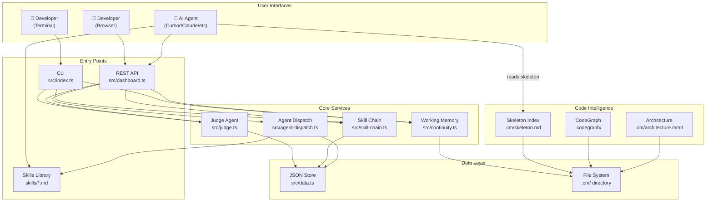

# System Architecture

> **Quick Reference**
> - **Pattern**: Modular Monolith (CLI + REST API in single process)
> - **Runtime**: Node.js with TypeScript
> - **Storage**: File-based JSON (zero external DB)
> - **API**: Express REST API (dashboard)
> - **CLI**: Commander.js

## High-Level Architecture



*Developers interact via CLI or Dashboard. AI agents read skills directly from filesystem and interact with the REST API. Code Intelligence provides pre-indexed structural understanding. All data persists to JSON files.*

## Code Intelligence (v3.5)

A 4-layer intelligence system that pre-indexes code structure for instant understanding:

| Layer | Name | Dependencies | Speed | Best For |
|-------|------|-------------|-------|----------|
| **0** | Skeleton Index | ZERO (grep/find/awk) | <4s | Any project — always-on foundation |
| **1** | Code Graph | tree-sitter + SQLite | ~30s | 50+ files — call chains, impact analysis |
| **2** | Architecture | LLM + Mermaid.js | ~10s | 20+ files — visual module map |
| **3** | Smart Context | All above + qmd | ~5s | Task-focused context packets |

### Dual-Brain Architecture (v4.0)

To achieve infinite scaling without AI context collapse, CodyMaster implements a **Hub-and-Spoke** memory architecture:

- **Master Brain (`codymaster`)**: A global NotebookLM instance storing meta-learnings, architecture wisdom, and core workflows.
- **Project Brains (`project_id`)**: Isolated NotebookLM instances for each project containing domain-specific PRDs, APIs, and business logic.
- **Wisdom Gatekeeper**: Local project learnings are filtered using the Rule of 3 (recurring ≥ 3 times). Only qualified "Graduated Wisdom" is pushed to the global Master Brain.

### 5-Tier Memory System

```
Tier 1: SENSORY        → Temporary session variables
Tier 2: WORKING        → CONTINUITY.md (~500 words)
Tier 3: LONG-TERM      → learnings.json, decisions.json
Tier 4: SEMANTIC TEXT   → qmd (BM25 + vector over docs)
Tier 5: STRUCTURAL     → CodeGraph + Skeleton Index
```

See [cm-codeintell](/skills/cm-codeintell) for complete documentation.

## Component Overview

### CLI (`src/index.ts`)

The primary interface for developers. Built with Commander.js, it provides commands for:

- **Task management** — add, list, move, done, dispatch
- **Project management** — add, list, remove
- **Deploy tracking** — staging, production, rollback
- **Working memory** — init, status, reset, learnings
- **Skill chain** — list, start, advance, auto
- **Judge** — evaluate task health, suggest agents

### Dashboard Server (`src/dashboard.ts`)

Express.js REST API that powers the browser-based Kanban dashboard.

- **SPA architecture** — static files served from `public/dashboard/`
- **Full CRUD** for projects, tasks, deployments, changelog
- **Real-time features** — transition validation, stuck task detection
- **Judge API** — task health evaluation, agent suggestions
- **Chain API** — start/advance/abort skill chain executions

### Judge Agent (`src/judge.ts`)

Autonomous task health evaluator:

- Detects **stuck tasks** (no updates for 30+ minutes)
- Evaluates **task complexity** and suggests priority changes
- Recommends **best agents** for specific skills
- Maps skills to **domains** (engineering, operations, product, etc.)
- Suggests valid **state transitions**

### Working Memory (`src/continuity.ts`)

Persistent context system — inspired by Loki Mode:

- **CONTINUITY.md** — current session state, active goal, next actions
- **learnings.json** — captured error patterns (persists across sessions)
- **decisions.json** — architecture decisions (persists across projects)
- **config.yaml** — RARV cycle settings

### Skill Chain (`src/skill-chain.ts`)

Multi-skill pipeline engine:

- **Predefined chains** — e.g., "feature" chain: planning → tdd → execution → review → deploy
- **Chain execution** — tracks progress through steps
- **Auto-matching** — matches task titles to appropriate chains
- **Skip/abort** — allows skipping steps or aborting chains

### Agent Dispatch (`src/agent-dispatch.ts`)

Dispatches tasks to AI agents with platform-specific adapters:

- Generates **dispatch files** for each AI platform
- Validates dispatch preconditions (agent assigned, project path exists)
- Supports **force re-dispatch** for retries

## Shared Helpers Layer (v4.0)

Skills reference reusable helpers from `skills/_shared/helpers.md` instead of embedding their own logic:

| Helper | Purpose |
|--------|---------|
| `#Load-Working-Memory` | Read CONTINUITY.md + learnings at start |
| `#Save-Decision` | Record architecture decision to decisions.json |
| `#Update-Continuity` | Save session state for next session |
| `#Identity-Check` | Verify git/deploy identity before push |
| `#Project-Level-Detection` | Auto-detect L0-L3 complexity |
| `#Outputs-Convention` | Standardize `.cm/outputs/` structure |

**Token savings:** ~750-1000 tokens per skill invocation.

## Project Level System (v4.0)

| Level | Task Type | Workflow Depth |
|-------|-----------|----------------|
| L0 | Quick fix, typo, config | Direct execution |
| L1 | Single feature, bug fix | Planning → TDD → Execute |
| L2 | Multi-component feature | Planning → FR/NFR → TDD → Quality Gate → Deploy |
| L3 | System redesign, migration | Full RARV cycle with all gates |

Auto-detected by `cm-start` based on task description and codebase analysis.

## Design Decisions

### Why File-based JSON Storage?

| Decision | Rationale |
|----------|-----------|
| JSON files over database | Zero setup overhead. `cm init` works immediately. No Docker, no PostgreSQL, no SQLite drivers. |
| Single data file | Atomic read/write. No migration scripts. Easy backup (just copy the file). |
| `.cm/` directory per project | Keeps working memory alongside code. Version-controllable context. |

### Why Modular Monolith?

| Decision | Rationale |
|----------|-----------|
| Single process | CLI and dashboard share the same data layer. No IPC overhead. |
| Module separation | Each concern (`judge`, `continuity`, `chain`) is a separate TypeScript module. Easy to test and refactor independently. |
| No microservices | For a developer tool, operational simplicity trumps scalability. One `npm install` and you're done. |

### Why Universal Skills Format?

| Decision | Rationale |
|----------|-----------|
| Plain markdown | Every AI agent can read markdown. No proprietary format required. |
| YAML frontmatter | Standard metadata format with `name` and `description` fields. |
| Platform adapters | Small adapter files translate the universal format to each platform's conventions (Antigravity, Claude, Cursor, etc.) |

## Technology Stack

| Layer | Technology | Rationale |
|-------|-----------|-----------|
| Language | TypeScript 5.9 | Type safety + Node.js ecosystem |
| CLI | Commander.js 14 | Industry standard CLI framework |
| HTTP | Express 5 | Lightweight REST API server |
| Testing | Vitest 4 | Fast, TypeScript-native test runner |
| Build | tsc + ts-node | Simple compilation, no bundler needed |
| Hosting | Cloudflare Pages | Edge deployment for landing page |
| Terminal UX | Chalk 5 | Cross-platform colored terminal output |

## Related

- [Data Flow →](./data-flow.md)
- [Deployment Guide →](./deployment.md)
- [API Reference →](./api/)
