# Cody Master Documentation

> **Quick Reference**
> - **Version**: 4.3.0
> - **Type**: Universal AI Agent Skills Framework
> - **Skills**: 35 skills in 6 domains
> - **Platforms**: Claude Code, Gemini/Antigravity, Cursor, Windsurf, Cline, Aider, Continue, Amazon Q, Amp, and more

## What is Cody Master?

Cody Master is a **skills framework** that turns AI coding agents into disciplined senior engineers. Instead of letting AI write spaghetti code, Cody Master enforces:

- 🔴 **TDD** — Write tests before code (`cm-tdd`)
- 🛡️ **Quality Gates** — Evidence-based verification, blind review, security scan (`cm-quality-gate`)
- 🧠 **Working Memory** — Context persists across sessions via CONTINUITY.md (`cm-continuity`)
- 🔒 **Secret Shield** — Pre-commit hooks, repo-wide leak detection, token lifecycle (`cm-secret-shield`)
- 📊 **Kanban Dashboard** — Real-time task tracking and workflow visibility (`cm-dashboard`)
- 🌐 **Universal Bootstrap** — Full project setup from Day 0 (`cm-project-bootstrap`)

```
Your Idea → Cody Master Skills → Production-Ready Code
```

## Quick Start

::: code-group

```bash [Bash (Universal)]
# Fastest & Interactive setup
bash <(curl -fsSL https://raw.githubusercontent.com/tody-agent/codymaster/main/install.sh) --all
```

```bash [Claude Code]
# One-liner installer (auto-detect language & scope)
bash <(curl -fsSL https://raw.githubusercontent.com/tody-agent/codymaster/main/install.sh) --claude
```

```bash [Gemini CLI]
# Auto-install for Antigravity/Gemini
bash <(curl -fsSL https://raw.githubusercontent.com/tody-agent/codymaster/main/install.sh) --antigravity
```

```bash [Aider / Continue / Q]
# Auto-detect and install for individual or all platforms
bash <(curl -fsSL https://raw.githubusercontent.com/tody-agent/codymaster/main/install.sh) --all
```

:::

## Documentation Structure

| Section | Content | Link |
|---------|---------|------|
| 🏗️ **Architecture** | System design, ADR, tech stack | [View →](./architecture.md) |
| 📊 **Data Flow** | RARV cycle, data flow, skill chain | [View →](./data-flow.md) |
| 🚀 **Deployment** | Installation, configuration, deployment | [View →](./deployment.md) |
| 🧩 **Skills Library** | All 35 skills — grouped, described, open source | [View →](./skills/) |
| 📖 **User Guides (SOP)** | Step-by-step for every feature | [View →](./sop/) |
| 💡 **Use Cases** | Workflows for developers, PMs, and designers | [View →](./use-cases/) |
| 🔌 **API Reference** | REST API + CLI commands | [View →](./api/) |

## Supported Platforms

| Platform | Status | Skill Invocation |
|----------|--------|-----------------|
| 🟣 Claude Code | ✅ | `/cm:skill-name` (plugin) |
| 🟢 Gemini / Antigravity | ✅ | `@[/skill-name]` |
| 🔵 Cursor | ✅ | `@skill-name` |
| 🟠 Windsurf | ✅ | `@skill-name` |
| 🟤 Cline / RooCode | ✅ | `@skill-name` |
| 🤖 Aider | ✅ | `@skill-name` |
| 🔗 Continue.dev | ✅ | `@skill-name` |
| ☁️ Amazon Q CLI | ✅ | `@skill-name` |
| ⚡ Amp | ✅ | `@skill-name` |
| 🐈 GitHub Copilot | ✅ | `skill-name` |
| 💻 Gemini CLI | ✅ | `@[/skill-name]` |
| 🔷 OpenCode / Codex | ✅ | `@skill-name` |

## Skills Overview — 6 Domains

```mermaid
graph TB
    CM["🧠 Cody Master<br/>35 Skills"]
    CM --> E["🔧 Engineering"]
    CM --> O["⚙️ Operations"]
    CM --> P["🎨 Product"]
    CM --> G["📈 Growth"]
    CM --> R["🎯 Orchestration"]
    CM --> W["🖥️ Workflow"]

    E --> E1["cm-tdd"]
    E --> E2["cm-debugging"]
    E --> E3["cm-quality-gate"]
    E --> E4["cm-test-gate"]
    E --> E5["cm-code-review"]
    E --> E6["cm-codeintell"]

    O --> O1["cm-safe-deploy"]
    O --> O2["cm-identity-guard"]
    O --> O3["cm-git-worktrees"]
    O --> O4["cm-terminal"]
    O --> O5["cm-secret-shield"]
    O --> O6["cm-safe-i18n"]

    P --> P1["cm-planning"]
    P --> P2["cm-brainstorm-idea"]
    P --> P3["cm-ux-master"]
    P --> P4["cm-ui-preview"]
    P --> P5["cm-dockit"]
    P --> P6["cm-project-bootstrap"]
    P --> P7["cm-readit"]
    P --> P8["cm-jtbd"]

    G --> G1["cm-content-factory"]
    G --> G2["cm-ads-tracker"]
    G --> G3["cm-cro-methodology"]

    R --> R1["cm-execution"]
    R --> R2["cm-continuity"]
    R --> R3["cm-skill-chain"]
    R --> R4["cm-skill-index"]
    R --> R5["cm-skill-mastery"]
    R --> R6["cm-deep-search"]
    R --> R7["cm-how-it-work"]
    R --> R8["cm-notebooklm"]

    W --> W1["cm-start"]
    W --> W2["cm-dashboard"]
    W --> W3["cm-status"]
```



Browse the full skill library with complete documentation: **[Skills Library →](./skills/)**

## Links

- 🌐 [Main Website](https://cody.todyle.com)
- 📦 [GitHub Repository](https://github.com/tody-agent/codymaster)
- 📖 [How It Works](./how-it-work.md)
- 🚀 [Installation Guide](./sop/installation.md)
